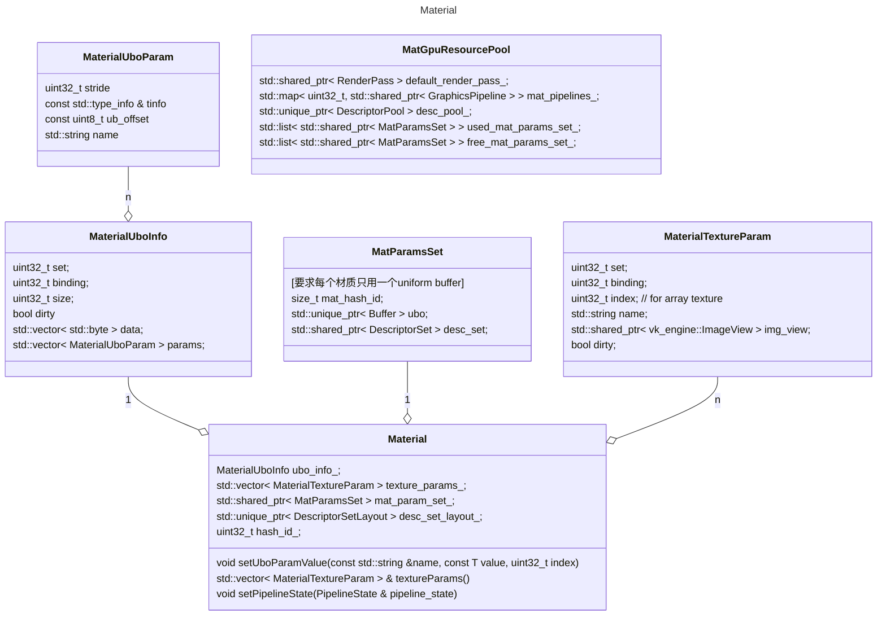

# vk_engine

doc use mermaid. [comparation between graphviz and mermaid](https://www.devtoolsdaily.com/diagrams/graphviz_vs_mermaidjs/)

## framework Modules

framework is the main code of this mini engine. including these modules:

* Platfrom
    include system specific window-system and its input event's abstract interface.
* utils
    include some general reuseable functions and code. like error、log、string、compiler marcos, memory allocator. also include gui interface and window_app/app interface ...
* scene
    Definition of components in the scene, as well as scene loading, rendering and other functions.
* vk
    vulkan objects' c++ wrapper. For easy use and resource managment.

数据绑定规约:

The descriptor set number 0 will be used for engine-global resources, and bound once per frame. // camera

The descriptor set number 1 will be used for material resources, 
and the number 2 will be used for per-object resources. 

This way, the inner render loops will only be binding descriptor sets 1 and 2, and performance will be high.

### scene
#### Material
Material类定义了某种材质(类似于Blender中的Material node), 负责对外提供该材质的渲染能力(pipeline state设置+DescriptorSetLayout获取, 参数设置、纹理设置等).

在引擎中材质种类有限, 但使用同一种材质的物体会很多. 因此对材质相关GPU资源构建缓存进行复用: `MatGpuResourcePool`.

#### Asset Loader
