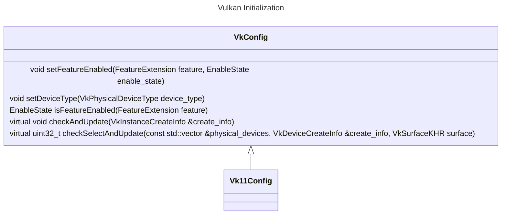
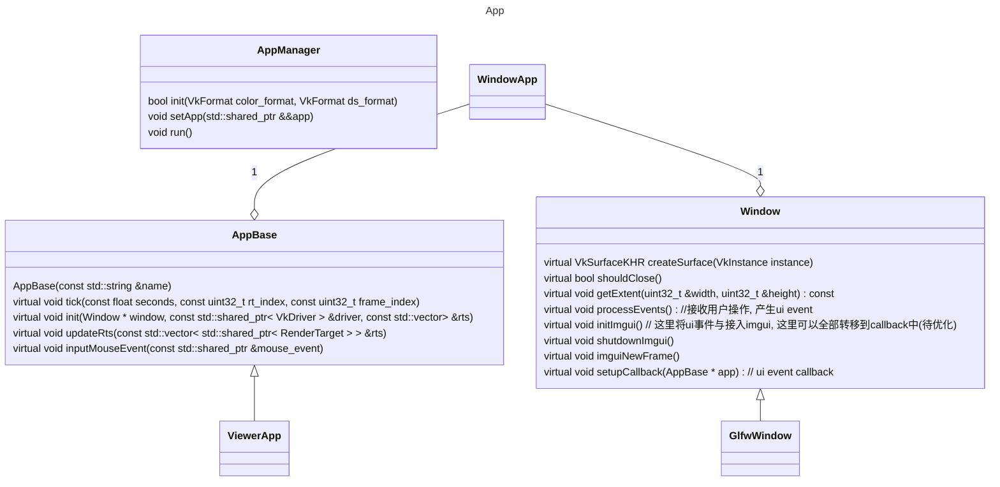
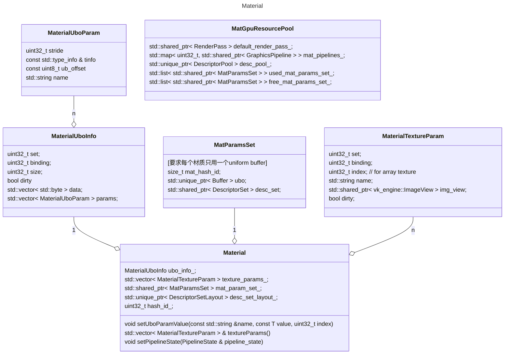

# vk_engine

doc use mermaid. 
[comparation between graphviz and mermaid](https://www.devtoolsdaily.com/diagrams/graphviz_vs_mermaidjs/)
[class diagram](https://mermaid.js.org/syntax/classDiagram.html)

vulkan quick start: [vulkan-in-30-minutes](https://renderdoc.org/vulkan-in-30-minutes.html)

## framework Modules

framework is the main code of this mini engine. including these modules:

* Platfrom
    include system specific window-system and its input event's abstract interface.
* utils
    include some general reuseable functions and code. like error、log、string、compiler marcos, memory allocator. also include gui interface and window_app/app interface ...
* scene
    Definition of components in the scene, as well as scene loading, rendering and other functions.
* vk
    vulkan objects' c++ wrapper. For easy use and resource managment.

数据绑定规约:

The descriptor set number 0 will be used for engine-global resources, and bound once per frame. // camera

The descriptor set number 1 will be used for material resources, 
and the number 2 will be used for per-object resources. 

This way, the inner render loops will only be binding descriptor sets 1 and 2, and performance will be high.

### Initialization
#### Vulkan
通过VkConfig类来设置Vulkan的配置: 需要启用的特性(instance extension, device extension), 使用的设备类型(独显/集显). 通过设置的信息, 该类帮助创建所需的create info并选择满足条件的physical device. 高版本的Vulkan会将一些原来的扩展作为默认的特性, VkConfig被设计为一个虚类(接口).

Vulkan的基础知识:
Instance创建时可以指定需要添加layer(validation layer), 通过instance来query系统中的device以及device的特性. 基本的流程是: `vkCreateInstance()` → `vkEnumeratePhysicalDevices()` → `vkCreateDevice()`.

#### App
* `Window` 是窗口的抽象基类(framework/platform/window.h). 由其负责窗口的创建、关闭、移动、缩放, imgUI的初始化接入, 接收用户的UI操作产生输入事件, 创建surface.
* `AppBase` 是应用程序的抽象基类(framework/utils/app_base.h). 实现了应用的真正逻辑, 包括初始化、每一帧的tick, 以及事件的处理.
* `WindowApp` 包含了`Window`和`AppBase`, 将他们组装成一个完整的功能类(framework/utils/window_app.h).

### scene
#### Material
Material类定义了某种材质(类似于Blender中的Material node), 负责对外提供该材质的渲染能力(pipeline state设置+DescriptorSetLayout获取, 参数设置、纹理设置等).

在引擎中材质种类有限, 但使用同一种材质的物体会很多. 因此对材质相关GPU资源构建缓存进行复用: `MatGpuResourcePool`.

#### Asset Loader

### UI
