# vk_engine

doc use mermaid. 
[comparation between graphviz and mermaid](https://www.devtoolsdaily.com/diagrams/graphviz_vs_mermaidjs/)
[class diagram](https://mermaid.js.org/syntax/classDiagram.html)

vulkan quick start: [vulkan-in-30-minutes](https://renderdoc.org/vulkan-in-30-minutes.html)

## framework Modules
| 模块 |  描述 |
| --- | --- |
| framework/platform | 与系统/平台相关的类: 窗口、UI事件的抽象以及实现等|
| framework/scene | 场景相关的数据类和操作类, 包括场景组件(相机、材质、mesh), 场景的加载、渲染. |
| framework/utils | 一些通用的功能函数、类, 例如: log、copiler、marcos、memory allocator、imageUI based UI element render和用来构建应用的AppManager. |
| framework/vk | vulkan 的功能封装, 给上层提供更简单的接口, 让上层以对象的方式管理vulkan资源, 并提供了一些功能类(例如Resource cache、stagepool), 以提升系统性能. |

数据绑定规约:

| descriptor set |  用途 |
| --- | --- |
| GLOBAL_SET_INDEX = 0 | 用来存一些全局的属性/参数(对场景中的所有物体有效的参数), 例如: 相机的参数. |
| MATERIAL_SET_INDEX = 1 | 用来存可能对一个或多个物体的属性/参数, 例如: 材质. |
| OBJECT_SET_INDEX = 2 | 用来存只对一个物体有效的参数. 例如: 物体的Rt. |

### Vulkan
#### Initialization
通过VkConfig类来设置Vulkan的配置, 高版本的Vulkan会将一些原来的扩展作为默认的特性, VkConfig被设计为一个虚类(接口).

| 函数 | 描述 |
| --- | --- |
| setFeatureEnabled | 设置启用的特性: instance extension, device extension |
| setDeviceType | 设置设备类型(独显/集显) |
| checkAndUpdate |  根据设置, 更新/设置VkInstanceCreateInfo |
| checkSelectAndUpdate | 根据设置+surface(可以是null), 选择合适的硬件设备, 并更新/设置VkDeviceCreateInfo |

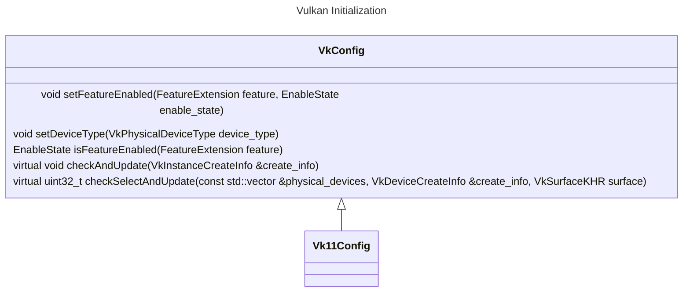

初始化流程图(VkDriver::init):
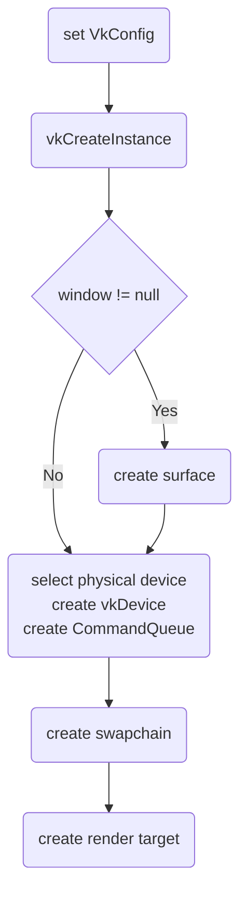

#### ShaderModule

利用glslang将shader+shader_variant编译成spirv, 利用spirv-cross解析shader中用到的资源, 以被构建DescriptorSetLayout --> PipelineLayout.

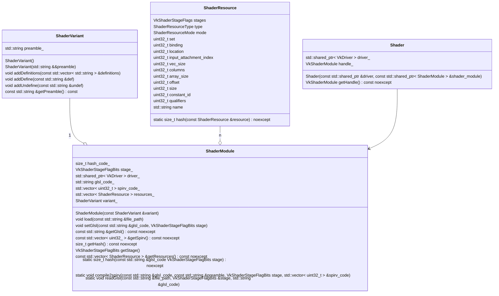

#### Pipeline
| 类 | 描述 |
| --- | --- |
| Pipeline | Pipeline接口, 通过其获取vkPipeline 和 PipelineLayout. |
| GPipelineState | 封装了Graphics PipelineState的数据属性. |
| GraphicsPipeline | 接受GPipelineState, 创建vulkan graphics pipeline. |

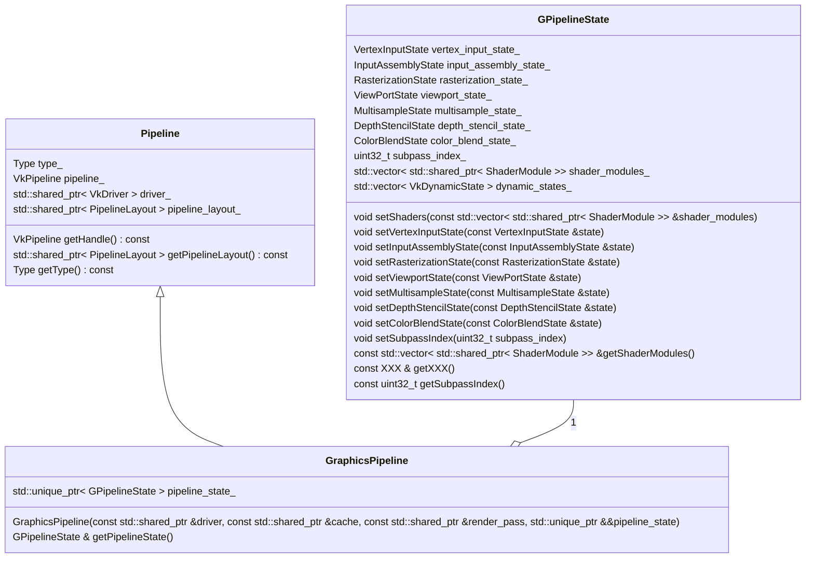

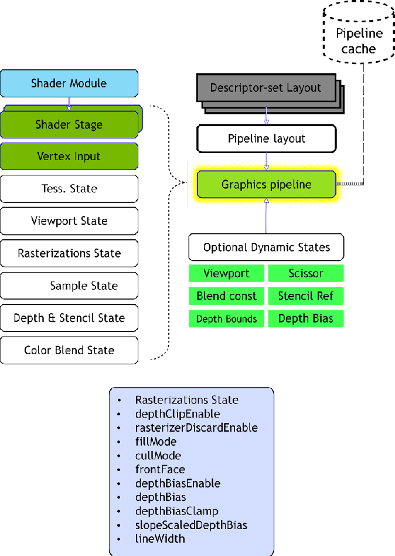

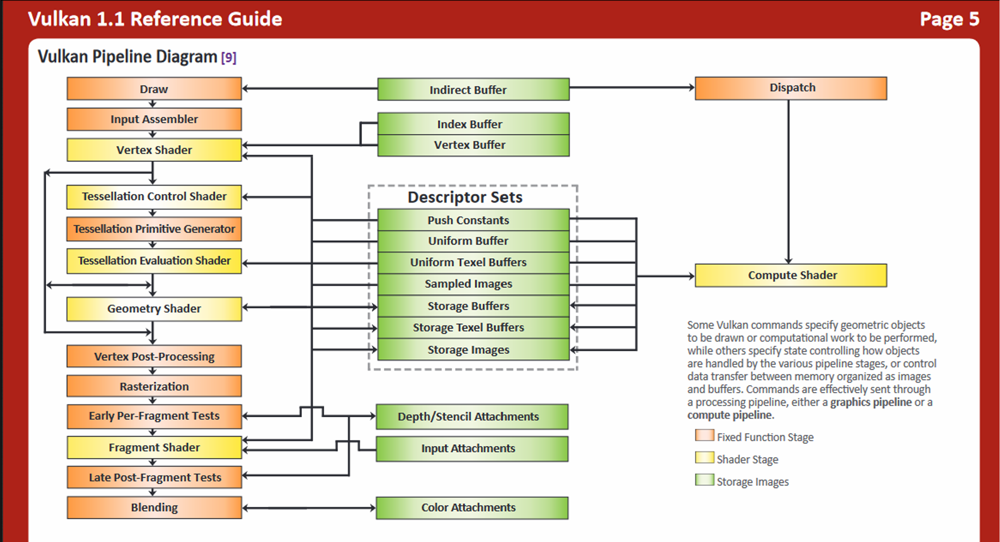

#### RenderPass & Framebuffer

| 类 | 描述 |
| --- | --- |
| RenderPass (framework\vk\render_pass.h) | 封装了vkRenderPass, 表示了这个渲染Pass中的输出设置: attachment的load/store, subpass以及subpass之间的依赖关系, ttachment与subpass之间的联系. |
| RenderTarget (framework\vk\frame_buffer.h)| 封装了渲染的输出目标(color output imageview + depth output imageview) |
| FrameBuffer (framework\vk\frame_buffer.h)| 封装了VkFrameBuffer, 是RenderPass和RenderTarget的组合. |

在GraphicsPipeline创建时就需要设置VkRenderPass, 但后续在真正渲染时, 只要渲染输出的FrameBuffer与GraphicsPipeline中的VkRenderPass兼容即可.
兼容性要求:
* attachment 数量相同(允许有VK_ATTACHMENT_UNUSED)
* 对应attachment的format、sample count一致
* 允许attachment有不同的extend, load/store, layout

#### DescriptorSet & DescriptorPool
* 创建
    应该是为了更好地配合多线程, 提高性能, 在Vulkan中DescriptorPool像是一个内存池, 需要先申请一个大的pool(定义好能从中申请的DescriptorSet的规格和容量). 后续DescriptorSet从pool中进行申请.
    在很多引擎中是直接申请一个最大的DescriptorPool, 在这里, 我针对材质设置了一个定制的DescriptorPool.
    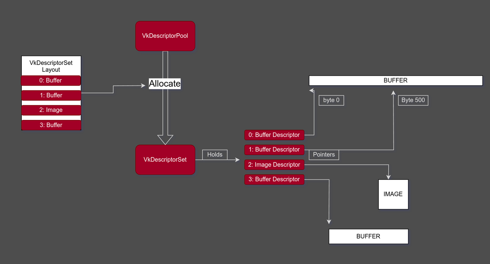

* 更新和复用
    参考[writing-an-efficient-vulkan-renderer](https://zeux.io/2020/02/27/writing-an-efficient-vulkan-renderer/), 为了更好的性能, 避免不必要的DescriptorSet创建开销. 对OBJECT_SET_INDEX(MeshParamsPool), MATERIAL_SET_INDEX(MatGpuResourcePool), GLOBAL_SET_INDEX(AppContext.descriptor_pool)分别设置了不同规格的DescriptorSetPool, 并对使用完的DescriptorSet进行缓存复用. 

#### CommandPool & CommandBuffer
与DescriptorSet类似, CommandBuffer同Pool中去申请以提升性能. 在这里每一个FrameBuffer绑定一个CommandPool, 在每帧开始时将CommandPool进行Reset(所有从中创建的CommandBuffer返回到initial state), 然后取一个已经创建或新建(若不足)一个CommandBuffer进行命令录制.
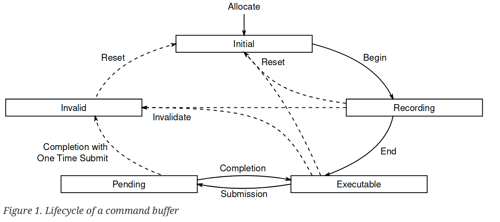

#### Synchronize

Vulkan中的三种同步对象:
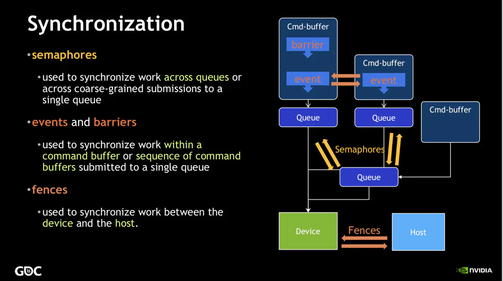

使用场景:
* 渲染和呈现循环
    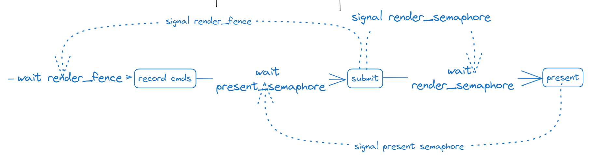
* RenderPass之间, 使用Barrier进行同步. 例如: 加载图片纹理后使用ImageBarrier将ImageLayout转换为OPTIMAL_LAYOUT. 在这里普通的场景渲染之后加了一个ImageBarrier, 然后再进行Imgui的渲染.

#### 功能类/函数

| 类 | 描述 |
| --- | --- |
| ResourceCache (framework/vk/resource_cache.h) | 参考Vulkan-Samples, 将一些可以服用的Vulkan 资源进行缓存复用, 例如: shader, DescriptorSetLayout, PipelineLayout, Sampler |
| StagePool (framework/vk/stage_pool.h) | 参考Filament, 一个GPU-CPU均能访问的buffer/image cache, 用来上传/下载数据. |

#### 渲染过程
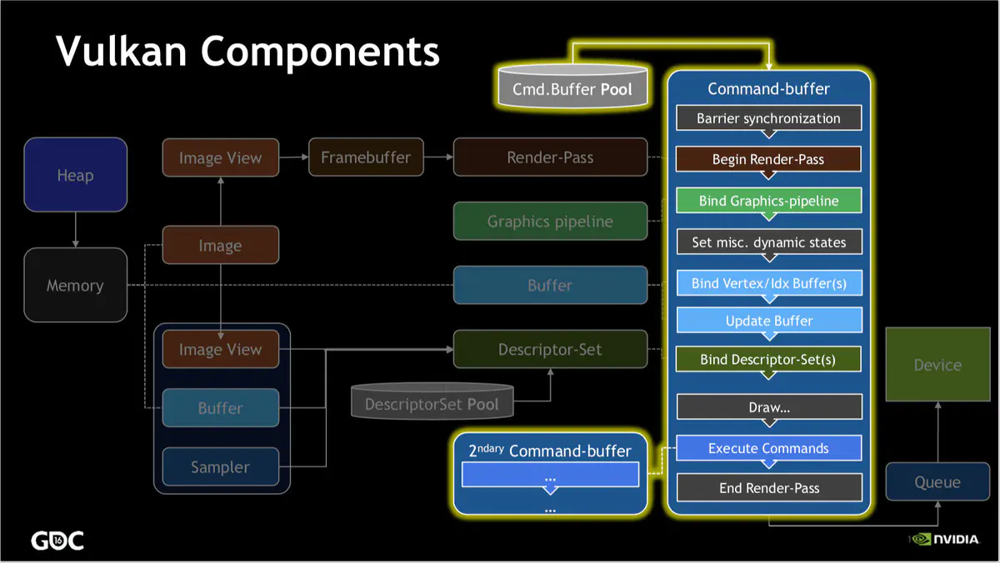

### App
| 类 |  描述 |
| --- | --- |
| Window (framework/platform/window.h) | 窗口的抽象基类. 由其负责窗口的创建、关闭、移动、缩放, imgUI的初始化接入, 接收用户的UI操作产生输入事件, 创建surface. |
| AppBase (framework/utils/app_base.h) | 应用程序的抽象基类. 实现了应用的真正逻辑, 包括初始化、每一帧的tick, 以及事件的处理. |
| AppManager (framework/utils/window_app.h) | 将Window和AppBase组装成一个完整的功能类 |
| AppContext (framework/utils/app_context.h) | 全局单例, 保存了整个系统的一些全局对象: driver, descriptor_pool(GLOBAL_SET_INDEX), stage_pool ...|

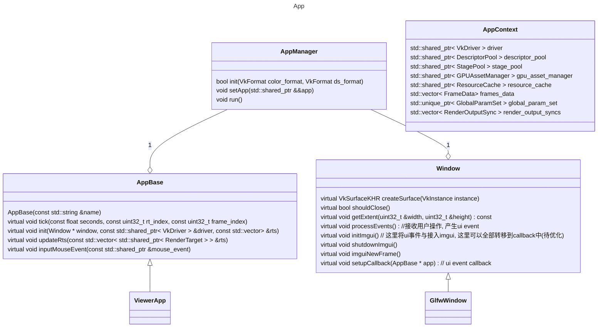

### scene
这里利用entt, 以ECS的架构来组建场景. 这里使用TransformRelationship, 来表示entity的父子关系(这里处于性能的考虑, 每个节点设置三个指针parent, child, sibling).

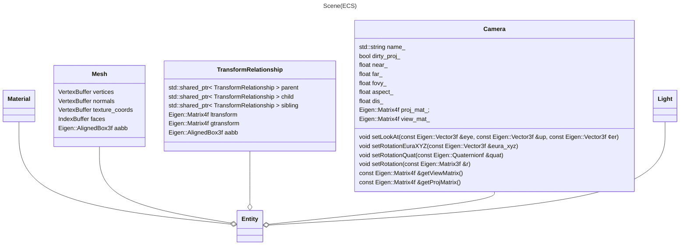

#### Material
Material类定义了某种材质(类似于Blender中的Material node), 负责对外提供该材质的渲染能力(pipeline state设置+DescriptorSetLayout获取, 参数设置、纹理设置等).

在引擎中材质种类有限, 但使用同一种材质的物体会很多. 因此对材质相关GPU资源构建缓存进行复用: `MatGpuResourcePool`.

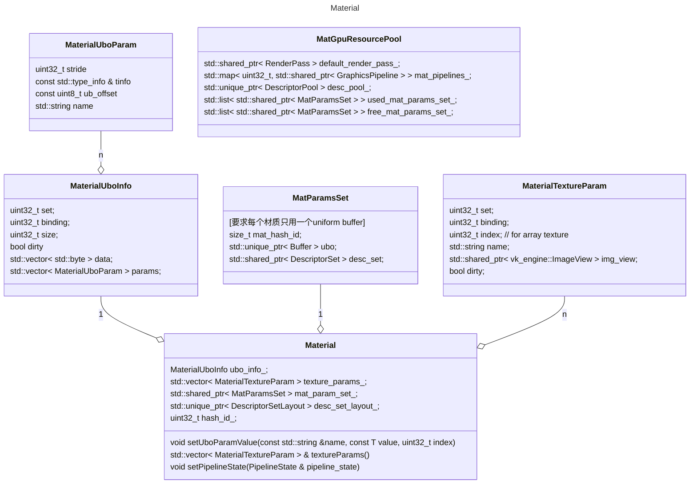

#### Asset Loader

| 类 | 描述 |
| --- | --- |
| GPUAssetManager (framework/scene/asset_manager.hpp) | 用来加载数据/资产到GPU, 例如image |
| AssimpLoader (framework/scene/loader.h) | 用来加载3d场景 |

数据加载的过程:

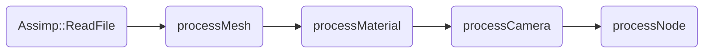

| 过程 | 描述 |
| --- | --- |
| Assimp::ReadFile | 使用assimp读取3d场景文件 |
| processMesh | 获取assimp中读取到的所有mesh, 转换成Mesh Component数组 |
| processMaterial | 获取assimp中读取到的所有material, 转换成Material Component数组 |
| processCamera | 获取assimp中读取到的所有camera, 转换成camera component |
| processNode | 根据assimp中的node信息, 创建Renderable entity, 构建场景树. |

#### Tick One Frame

## Reference
https://zeux.io/2020/02/27/writing-an-efficient-vulkan-renderer/