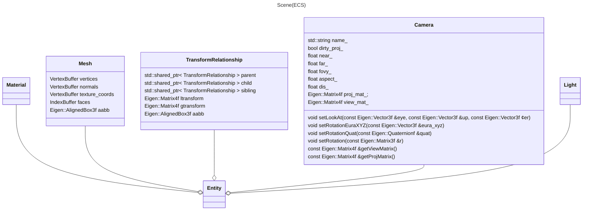
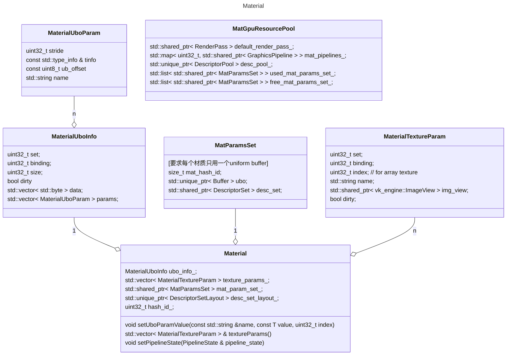
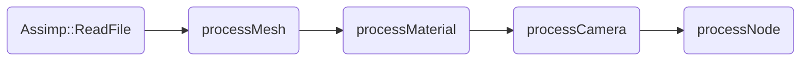

### scene
这里利用entt, 以ECS的架构来组建场景. 这里使用TransformRelationship, 来表示entity的父子关系(这里处于性能的考虑, 每个节点设置三个指针parent, child, sibling).

#### Material
Material类定义了某种材质(类似于Blender中的Material node), 负责对外提供该材质的渲染能力(pipeline state设置+DescriptorSetLayout获取, 参数设置、纹理设置等).

在引擎中材质种类有限, 但使用同一种材质的物体会很多. 因此对材质相关GPU资源构建缓存进行复用: `MatGpuResourcePool`.

#### Light

基于物理的度量, 灯光的亮度度量 $\to$ 反射亮度度量 $\to$ 曝光 $\to$ 图片.

refer to filament: https://google.github.io/filament/Filament.md.html#lighting/directlighting

| Photometric term | Notation | Unit |

#### Asset Loader

| 类 | 描述 |
| --- | --- |
| GPUAssetManager (framework/scene/asset_manager.hpp) | 用来加载数据/资产到GPU, 例如image |
| AssimpLoader (framework/scene/loader.h) | 用来加载3d场景 |

数据加载的过程:

| 过程 | 描述 |
| --- | --- |
| Assimp::ReadFile | 使用assimp读取3d场景文件 |
| processMesh | 获取assimp中读取到的所有mesh, 转换成Mesh Component数组 |
| processMaterial | 获取assimp中读取到的所有material, 转换成Material Component数组 |
| processCamera | 获取assimp中读取到的所有camera, 转换成camera component |
| processNode | 根据assimp中的node信息, 创建Renderable entity, 构建场景树. |

#### Tick One Frame
